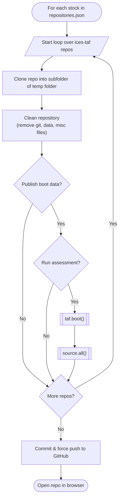

# ices-advice.taf-universe

## Publishing Stocks on ices-advice

When publishing a stock to the `ices-advice` github organisation, the github workflow does the following for each stock listed in `repositories.json`



An example repositories.json file is:

```json
[
  {
    "repo_name": "2026_san.sa.1r",
    "repos": ["2026_san.sa.1r_assessment"],
    "subdir": [""],
    "year": 2026,
    "safe": true,
    "run": false
  },
  {
    "repo_name": "2026_san.sa.2r",
    "repos": ["2026_san.sa.2r_assessment"],
    "subdir": [""],
    "year": 2026,
    "safe": true,
    "run": false
  },
  {
    "repo_name": "2026_san.sa.3r",
    "repos": ["2026_san.sa.3r_assessment"],
    "subdir": [""],
    "year": 2026,
    "safe": true,
    "run": false
  }
]
```
