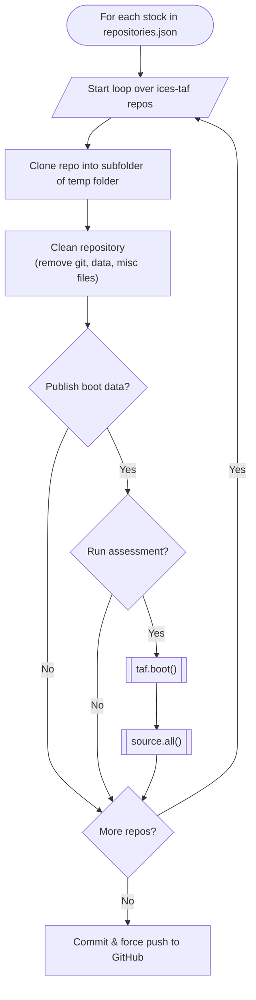

# ices-advice.taf-universe

## Publishing Stocks on ices-advice

When publishing a stock to the `ices-advice` github organisation, the github workflow does the following for each stock listed in `repositories.json`



An example repos.json file is below:

You can optionally have your TAF folder in a subdirectory of the source repo
and this can be done by setting the `subdir` feild element of the repos array to something appropriate, `"subdir": "my_assessment"` for example. Another option is to set `"safe": "true"` which is interpreted as meaning your `boot/initial/data` folder is safe to publish for that repo. Unfortunately the `"run"` feild is forced to `false` currently.

```json
[
  {
    "repo_name": "2026_her.27.6aS7bc",
    "publish_after_utc": "2026-04-30 10:00",
    "repos": [
      {
        "name": "2026_her.27.6aS7bc_assessment"
      }
    ]
  },
  {
    "repo_name": "2026_her.27.irls",
    "publish_after_utc": "2026-04-30 10:00",
    "repos": [
      {
        "name": "2026_her.27.irls_assessment",
        "run": false,
        "safe": true,
        "subdir": "taf_code"
      }
    ]
  }
]
```
