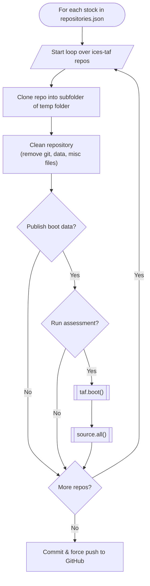

# ices-advice.taf-universe

## Publishing Stocks on ices-advice

When publishing a stock to the `ices-advice` github organisation, the github workflow does the following for each stock listed in `repositories.json`


```mermaid
flowchart TD

REPOS([For each stock in repositories.json])

REPOS --> LOOP[/Start loop over ices-taf repos/]

LOOP --> CLONE[Clone repo into subfolder of temp folder]
CLONE --> CLEAN["Clean repository<br/>(remove git, data, misc files)"]

CLEAN --> SAFE{Publish boot data?}

SAFE -->|Yes| RUN{Run assessment?}
SAFE -->|No| MORE

RUN -->|Yes| BOOT[["taf.boot()"]]
RUN -->|No| MORE[["taf.boot()"]]

BOOT --> SOURCE[["source.all()"]]


SOURCE --> MORE{More repos?}
MORE -->|Yes| LOOP
MORE -->|No| COMMIT

COMMIT[Commit & force push to GitHub]
```

An example repos.json file is below:

You can optionally have your TAF folder in a subdirectory of the source repo
and this can be done by setting the `subdir` feild element of the repos array to something appropriate, `"subdir": "my_assessment"` for example. Another option is to set `"safe": "true"` which is interpreted as meaning your `boot/initial/data` folder is safe to publish for that repo. Unfortunately the `"run"` feild is forced to `false` currently.

```json
[
  {
    "repo_name": "2026_her.27.6aS7bc",
    "publish_after_utc": "2026-04-30 10:00",
    "repos": [
      {
        "name": "2026_her.27.6aS7bc_assessment"
      }
    ]
  },
  {
    "repo_name": "2026_her.27.irls",
    "publish_after_utc": "2026-04-30 10:00",
    "repos": [
      {
        "name": "2026_her.27.irls_assessment",
        "run": false,
        "safe": true,
        "subdir": "taf_code"
      }
    ]
  }
]
```

## Publishing the head commit of a repository

The workflow `.github/workflows/publish-head.yml` publishes a snapshot of the
HEAD commit of each repository listed in `head_repos.json` from `ices-taf` to
a **public** repository of the same name in `ices-advice`. The code is copied
as-is (no cleaning, no TAF run), and only a single commit is pushed, so the
source history is not exposed. A repository is only republished when its HEAD
has changed since the last publish, as recorded in `published_head_commits.json`.

It runs when `head_repos.json` changes, daily at 10:30 UTC, and on demand.

```json
[
  {
    "name": "2026_impacts.rebuilding.HCRs.mixed.fisheries_SpecialRequest"
  }
]
```

Optional fields per entry: `target_name` (name of the repo in `ices-advice`,
defaults to `name`), `branch` (source branch, defaults to the default branch),
`org_source` and `org_target`.
